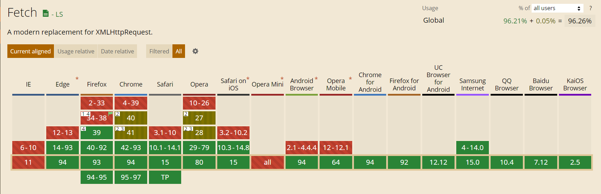

## Fetch API 学习笔记

`fetch()` 是 [XMLHttpRequest](https://developer.mozilla.org/zh-CN/docs/Web/API/XMLHttpRequest) 的升级版，用于在 JavaScript 脚本里面发出 HTTP 请求。

浏览器原生提供了这个对象。浏览器支持情况参照[Can I use](https://caniuse.com/fetch)


### 基本用法

`fetch()` 的功能与XMLHttpRequest基本相同，但有三个主要的差异。
1. `fetch()` 使用Promise，不适用回调函数，因此大大简化了写法，写起来更简洁。
2. `fetch()` 采用模块化设计，API分散在多个对象上(Request对象、Header对象、Response对象)，更合理一些；相比之下，XMLHttpRequest的API设计并不是很好，输入、输出、状态都在同一个接口管理，容易写出非常混乱的代码。
3. `fetch()` 通过数据流(Stream 对象)处理数据，可以分块读取，有利于提高网站性能表现，减少内存占用，对于请求大文件或者网速慢的场景相当有用。XMLHttpRequest对象不支持数据流，所有的数据必须放在缓存里，不支持分块读取，必须等待全部拿到后，再一次性吐出来。

在用法上，`fetch()`接受一个URL字符串作为参数，默认向该网址发出GET请求，返回一个 Promise 对象。它的基本用法如下：
``` js
fetch(url)
.then(...)
.catch(...)
```

下面是一个例子，从服务器获取 JSON 数据。
``` js
fetch('https://api.github.com/users/hbche')
.then(response => response.json())
.then(data => console.log(data))
.catch(err => colsole.log('Request Failed', err))
```

上面示例中，`fetch()`接收到的 `response` 是一个 [Stream 对象](https://developer.mozilla.org/en-US/docs/Web/API/Streams_API)，`response.json()` 是一个异步操作，取出所有内容，并将其转为 JSON 对象。

Promise 可以使用 await 语法改写，使得语义更清晰。
``` js
async function getJSON() {
    const url = 'https://api.github.com/users/hbche';
    try {
        const response = await fetch(url);
        return await response.json();
    } catch (err) {
        console.log('Request Failed', error);
    }
}
```
上面的示例中，`await` 语句必须放在 `try...catch...` 里面，这样才能捕捉异步操作中可能发生的错误。

### Response对象：处理HTTP响应

#### Response 对象的同步属性
`fetch()` 请求成功后，得到的是一个 [Response对象](https://developer.mozilla.org/zh-CN/docs/Web/API/Response)。它对应服务器的HTTP响应。
``` js
const response = await fetch(url);
```

前面说过，Response 包含的数据通过 Stream 接口异步读取，但是它还包含一些同步属性，对应 HTTP 回应的标头信息（Headers），可以立即读取。

``` js
async function fetchText() {
  let response = await fetch('/readme.txt');
  console.log(response.status); 
  console.log(response.statusText);
}
```

### fetch()的第二个参数：定制HTTP请求

### fetch()配置对象的完整API

### 取消fetch()请求

