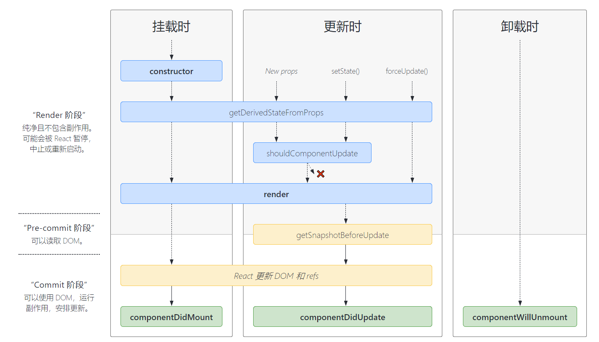

# React.Component

## 概览

1. 定义Class组件，需要继承 `React.Component` 
2. 在Class组件中必须实现 `render` 方法
3. 在React组件中，代码重用的主要方式是组合而不是继承

### 组件的生命周期


1. 挂载
- constructor()
- static getDerivedStateFromProps()
- render()
- componentDidMount()

2. 更新
- static getDreivedStateFromProps()
- shouldComponentUpdate(nextProps, nextState)
- render()
- getSnapshotBeforeUpdate(prevProps, prevState)
- componentDidUpdate(prevProps, prevState, snapshot)

1. 卸载
- componentWillUnmount()

4. 错误处理
- statis getDerivedStateFromError()
- componentDidCatch()

5. 其他APIs
- setState()
- forceUpdate()

> derived:  /dɪˈraɪvd/ 导出的；衍生的，派生的

### class属性
- defaultProps
- displayName

### 实例属性
- props
- state

## 常用生命周期方法
查看完成的生命周期方法，请查看 [React组件生命周期图谱](https://projects.wojtekmaj.pl/react-lifecycle-methods-diagram/)

### constructor(props)
- 如果不初始化 state 或不进行方法绑定，则不需要为React组件实现构造函数
- 在React组件挂载之前，会调用它的构造函数
- 在为React.Component子类实现构造函数时，应该在其他语句之前调用 `super(props)`，即构造函数内部的第一个语法调用应该是 `super(props)`。否则，`this.props` 在构造函数中可能出现未定义的bug
- 只能在构造函数中直接为 `this.state` 赋值。如需在其他方法中赋值，应该使用 `this.setState()` 方法代替。
- 避免在构造函数中引入任何副作用或订阅，遇到此场景，请将对应的操作放置在 `componentDidMount` 中。
- 避免将 `props` 的值赋值给 `state`！这是一个常见的错误

通常，在 React 中，构造函数仅用于以下两种情况：
1. 通过给 `this.state` 赋值对象来初始化内部state
2. 为 事件处理函数 绑定实例(上下文)

在 `constructor()` 函数中 **不要使用 setState() 方法**。如果组件需要使用内部 state，直接在构造函数中为 **this.state 赋值初始 state 即可**
``` js
constructor(props) {
    super(props);
    // 不要在这里调用 setState()
    this.state = {
        counter: 0,
    };
    this.handleClick = this.handleClick.bind(this);
}
```
避免将 props 的值赋值给 state！这是一个常见的错误：
``` js
constructor(props) {
    super(props);
    // 不要这样做
    this.state = {
        color: this.props.color
    };
}
```
因为这样做毫无意义(可以直接使用this.props.color)，同时还产生了bug(更新 props 中的 `color` 时。并不会影响 state)。

**只有在刻意忽略 props 更新的情况下使用**。

参阅 [你可能不需要派生 state](./blog/you-probably-dont-need-derived-state.md)，学习如何处理 state 依赖 props 的情况。

### render()
1. `render()` 方法是 class 组件中唯一必须实现的方法。
2. `render()` 函数应该为**纯函数**，并且在函数内部不会直接与浏览器交互。如需要与浏览器交互，请在 `componentDidMount()` 或其他生命周期方法中执行对应的操作。
3. 如果 `shouldComponentUpdate()` 返回 false，则不会调用 `render()` 。

当 `render` 被调用时，它会检查 `this.props` 和 `this.state` 的变化并返回以下类型之一：
- **React元素**。通常通过 JSX 创建。例如，`<div />` 会被 React 渲染为 DOM 节点，`<MyComponent />` 会被 React渲染成自定义组件，无论是 `<div />` 还是 `<MyComponent />` 均为 React 元素。
- **数组或 fragments**。使得 render 方法可以渲染多个元素。
- **Portals**。可以渲染子节点到不同的 DOM 子树中。
- **字符串或数值类型**。它们在 DOM 中会被渲染成文本节点。
- **布尔值或null**。什么都不渲染。(主要用于支持返回 `{test && <Child />}` 的模式，其中 test 为布尔型)


### componentDidMount()
1. `componentDidMount()` 会在组件挂载后（插入到 DOM 树中）立即调用。依赖于 DOM 节点的初始化应该放在这里。如需通过网络请求获取数据，此处是实例化请求的好地方。
2. 这个方法是比较适合添加订阅的地方。如果添加了订阅，请不要忘记在 `componentWillUnMount()` 里取消订阅。
3. 在 `componentDidMount()` 里可以直接调用 `setState()`。它将触发额外的渲染，但此渲染会发生在浏览器更新屏幕之前。请谨慎使用，此方式存在性能问题。

### componentDidUpdate(prevProps, prevState, snapshot)
componentDidUpdate() 会在更新后被立即调用，首次渲染不会执行此函数。

在组件更新后，可以在此处对 DOM 进行操作。如果你对更新前后的 props 进行了比较，也可以选择在此进行网络请求。（例如，当 props 未发生变化时，则不会执行网络请求）

``` js
componentDidUpdate(prevProps, prevState, snapshot) {
  if (this.props.userID !== prevProps.userID) {
    this.fetchData(this.props.userID);
  }
}
```

也可以在 componentDidUpdate() 中**直接调用 setState()**，但请注意**它必须被包裹在一个条件语句里**，否则会导致死循环，还会导致额外的重新渲染，影响组件性能。不要将 props 复制给 state，请考虑直接使用 props。

如果组件实现了 getSnapshotBeforeUpdate() 生命周期(不常用)，则它的返回值将作为 componentDidUpdate() 第三个参数 "snapshot" 参数传递。否则此参数将为 undefined。

> 如果 shouldComponentUpdate() 返回值为 false，则不会调用 componentDidUpdate()。

### componentWillUnmount()
componentWillUnmount() 会在组件卸载及销毁之前直接调用。在此方法中执行必要的清理操作，例如，清楚 timer，取消网络请求或者清除在 componentDidMount() 中创建的订阅等。

componentWillUnmount() 中**不应调用 setState()**，因为该组件将永远不会重新渲染。组件实例卸载后，将永远不会再挂载它。

## 不常用的生命周期

### shouldComponentUpdate()
``` js
shouldComponentUpdate(nextProps, nextState)
```
根据 shouldComponentUpdate() 的返回值，判断当前 React 组件的输出是否受当前 state 或 props 更改的影响。默认行为是 state 每次发生变化时组件都会重新渲染。大部分情况下，应该遵循默认行为。

当 props 或 state 发生变化时，shouldComponentUpdate() 会在渲染执行之前被调用。返回值默认为 true。**首次渲染或执行 forceUpdate() 时不会调用该方法。**

此方法仅作为**性能优化的方式**存在。不要企图依靠此方法来"阻止"渲染，这样做会产生 bug。应该考虑使用内置的 PureComponent 组件，而不是手动编写 shouldComponentUpdate()。PureComponent 会对 props 和 state 进行浅层比较，并减少跳过必要更新的可能性。

如果你一定要手动编写此函数，可以将 this.props 与 nextProps 以及 this.state 与nextState 进行比较，并返回 false 以告知 React 可以跳过更新。请注意，返回 false 并不会阻止**子组件**在 state 更改时重新渲染。

我们不建议在 shouldComponentUpdate() 中进行深层比较或使用 JSON.stringify()。这样非常影响效率，且会损害性能。

目前，如果 shouldComponentUpdate() 返回 false，则不会调用 UNSAFE_componentWillUpdate()，render() 和 componentDidUpdate()。后续版本，React 可能会将 shouldComponentUpdate 视为提示而不是严格的指令，并且，当返回 false 时，仍可能导致组件重新渲染。

### static getDeveriedStateFromProps()
``` js
static getDerivedStateFromProps(props, state)
```

getDeveriedStateFromProps() 会在调用 render() 方法之前调用，并且在初始化挂载及后续更新时都会被调用。它应该返回一个对象来更新 state，如果返回 null 则不更新任何内容。

派生 state 会导致代码冗余，并使组件难以维护。
- 如果需要执行副作用（例如，数据提取或动画）以响应 props 中的更改，请改用 componentDidUpdate
- 如果只想在 props 更改时重新计算某些数据，请使用 memoization 代替
- 如果想在 props 更改时"重置"某些 state，请考虑使用**受控组件**或使用**key使组件完全不受控**代替。

> 注意，不管什么原因，每次渲染前都会调用此方法。getDerivedStateFromProps() 与 UNSAFE_componentWillReceiveProps 形成对比，后者仅在父组件重新渲染时触发，而不是在内部调用 setState 时触发。

### getSnapshotBeforeUpdate()
``` js
getSnapshotBeforeUpdate(prevProps, prevState)
```
getSnapshotBeforeUpdate() 在最近一次渲染输出（提交到 DOM 节点）之前调用。它使得组件能在发生更改之前从 DOM 中捕获一些信息（例如，滚动位置）。此生命周期的任何返回值将作为参数传递给 componentDidUpdate()。

此方法不常用，但它可能出现在 UI 处理中，如需要以特殊方式处理滚动位置的聊天线程等。

``` jsx
class ScrollingList extends React.Component {
  constructor(props) {
    super(props);
    this.listRef = React.createRef();
  }

  getSnapshotBeforeUpdate(prevProps, prevState) {
    if (prevProps.list.length < this.props.list.length) {
      const list = this.listRef.current;
      return list.scrollHeight - list.scrollTop;
    }
    return null;
  }

  componentDidUpdate(prevProps, prevState, snapshot) {
    if (snapshot !== null) {
      const list = this.listReg.current;
      list.scrollTop = list.scrollHeight - snapshot;
    }
  }

  render() {
    return (
      <div ref={this.listRef}>{/* ...contents...*/}</div>
    );
  }

}
```

## 错误边界生命周期

### static getDerivedStateFromError()
``` jsx
static getDerivedStateFromError(error)
```

### componentDidCatch()
``` jsx
componentDidCatch(error, info)
```

## 其他 API

### setState()
``` js
setState(updater, [callback])
```
setState() 将对组件 state 的更改排入队列，并通知 React 需要使用更新后的 state 重新渲染此组件及其子组件。这是用于更新用户界面以响应事件处理器和处理服务器数据的主要方式。

将 setState() 视为请求而不是立即更新组件的命令。为了更好的感知性能，React 会延迟调用它，然后通过一次传递更新多个组件。React 并不会保证 state 的变更会立即生效。

setState() 并不总是立即更新组件。它会批量推迟更新。这使得在调用 setState() 后立即读取 this.state 成为了隐患。为了消除隐患，请使用 componentDidUpdate 或者 setState 的回调函数（setState(updater, callback)），这两种方式都可以保证在应用更新后触发。

除非 shouldComponentUpdate() 返回 false，否则 setState() 将始终执行重新渲染操作。如果可变对象被使用，且无法在 shouldComponentUpdate() 中实现条件渲染，那么仅在新旧状态不一时调用 setState()可以避免不必要的重新渲染。

updater 函数：
``` js
(state, props) => stateChange
```
state 是对应用变化时组件状态的引用。当然，它不应直接被修改。你应该使用基于 state 和 props 构建的新对象来表示变化。例如，假设我们想根据 props.step 来增加 state：
``` js
this.setState((state, props) => {
  return {counter: state.counter + props.step};
});
```
updater 函数中接收的 state 和 props 都保证为最新。updater 的返回值会与 state 进行**浅合并**。

setState() 的第二个参数为可选的回调函数，它将在 setState 完成合并并重新渲染组件后执行。通常，我们建议使用 componentDidUpdate() 来代替此方式。

setState() 的第一个参数除了接受函数外，还可以接受对象类型：
``` js
setState(stateChange[, callback]);
```
stateChange 会将传入的对象浅层合并到新的 state 中，例如，调整购物车商品数：
``` js
setState({quantity: 2});
```
这种形式的 setState() 也是异步的，并且在同一周期内会对多个 setState 进行批处理。例如，如果在同一周期内多次设置商品数量增加，则相当于：
``` js
Object.assign(
  previousState,
  {quantity: state.quantity + 1},
  {quantity: state.quantity + 1},
  ...
)
```
后调用的 setState() 将覆盖同一周期内先调用 setState 的值，因此商品数仅增加一次。如果后续状态取决于当前状态，我们建议使用 updater 函数的形式代替：
``` js
this.setState((state) => {
  return {quantity: state.quantity + 1};
});
```

> - State 和生命周期
> - 何时以及为什么 setState() 会批量执行?
> - 为什么不直接更新 this.state?

### forceUpdate()
``` js
component.forceUpdate(callback);
```
默认情况下，当组件的 state 或 props 发生变化时，组件将重新渲染。如果 render() 方法依赖于其他数据，则可以调用 forceUpdate() 强制让组件重新渲染。

调用 forceUpdate() 将致使组件调用 render() 方法，此操作会跳过该组件的 shouldComponentUpdate()。但其子组件会触发正常的生命周期方法，包括 shouldComponentUpdate() 方法。如果标记发生变化，React 仍将只更新 DOM。

通常应该避免使用 forceUpdate()，尽量在 render() 中使用 this.state 和 this.props。


## Class属性

### defaultProps
defaultProps 可以为 class 组件添加默认 props。这一版用于 props 未赋值，但又不能为 null 的情况。例如：
``` js
class CustomButton extends React.Component {

}

CustomButton.defaultProps = {
  color: 'blue'
};
```
如果未提供 props.color，则默认设置为 'blue'
``` js
render() {
  // props.color 将被设置为 'blue'
  return (<CustomButton />);
}
```
如果 props.color 被设置为 null，则它将保持为 null
``` js
render() {
  // props.color 将保持是 null
  return (<CustomButton color={null} />);
}
```

### displayName
displayName 字符串多用于调式信息。通常不需要设置它，因为它可以根据函数组件或 class 组件的名称推断出来。

## 实例属性

### props
需要特殊注意，this.props.children 是一个特殊的 prop，通常由 JSX 表达式中的子组件组成，而非组件本身定义。

### state
组件中的 state 包含了随时可能发生变化的数据。state 由用户自己定义，它是一个普通 JavaScript 对象。

如果某些值未用于渲染或数据流（例如，计时器ID），则不必将其设置为 state。此类值可以在组件实例上定义。

永远不要直接修改 this.state，因为后续调用的 setState() 可能会替换掉我们的改变，必须将 this.state 看作是不可变的。

> - [state Vs state](https://kentcdodds.com/blog/props-vs-state)