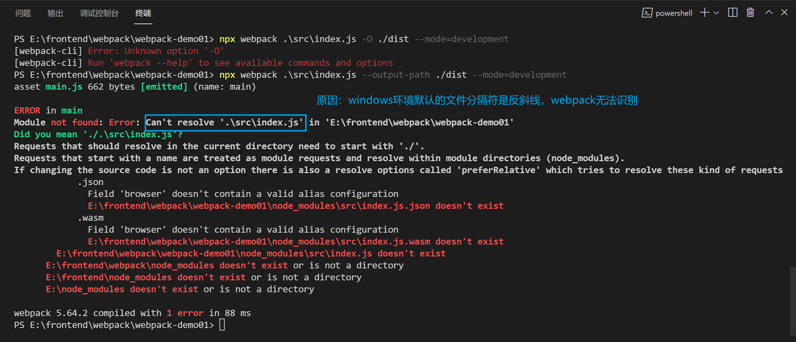
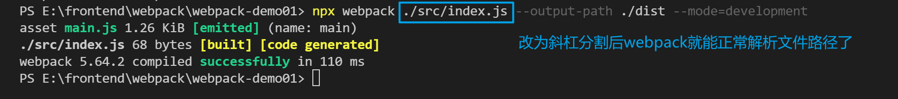

# Webpack 概述

1. 简介
2. 核心概念
3. 最佳实践
4. 配置文件

## 简介

- Webpack = Web Package
- Webpack 是一个现代 JS 应用程序的静态模块打包器(module handler)
- [官网](https://webpack.js.org)
- 特点
  - 功能强大(打包、构建、发布 Web 服务)
  - 学习成本高

1. 怎样理解模块和打包？

   - 构建(转换)就是将不支持的代码转换为支持的代码

   - 打包(合并)就是将多个文件合并成一个文件

- Webpack 的功能
- 将多个文件合并(打包)，减少 HTTP 请求次数，从而提高效率
- 对代码进行编译，确保浏览器兼容性
- 对代码进行压缩，减少文件体积，提高加载速度
- 检测代码格式，确保代码质量
- 提供热更新服务，提高开发效率
- 针对不同的环境，提供不同的打包策略

## Webpack 核心概念

### 入口

- 打包时，第一个被访问的源码文件
- 默认是 src/index.js(可以通过配置文件指定)
- webpack 通过入口，加载整个项目的依赖

### 出口

- 打包后，输出的文件
- 默认是 dist/main.js(可以通过配置文件指定)

### loader

- 专门用来处理一类文件(非 JS)的工具
  - webpack 默认只能识别 JS，想要处理其他类型的文件，需要对应的 loader
- 命名方式：xxx-loader(css-loadedr | html-loader | file-loader)
  - 以 -loader 为后缀
- [常用加载器](https://www.webpackjs.com/loaders/)

### plugin

- 实现 loader 之外的其他功能
  - plugin 是 webpack 的支柱，用来实现丰富的功能
- 命名方式：xxx-webpack-plugin (html-webpack-plugin)
  - 以 -webpack-plugin 为后缀
- [常用插件](https://www.webpackjs.com/plugins/)

### 模式

- 用来区分环境的关键字
  - 不同环境的打包逻辑不同，因此需要区分
- 三种模式
  - development (自动优化打包速度，添加一些调试过程中的辅助)
  - production (自动优化打包结果)
  - none (运行最为原始的打包，不做任何额外处理)

### 模块

- webpack 中，一切资源都是模块
  - JS 模块
  - CSS 代码
  - 字体文件
  - 图片
  - ...

[详情](https://www.webpackjs.com/concepts/modules/)

### [依赖图](https://www.webpackjs.com/concepts/dependency-graph/)

## 最佳实践

- 初始化项目

```
mkdir myprojects && cd myprojects && npm init -y
```

- 安装 Webpack

```
npm install --save-dev webpack webpack-cli
```

- 创建入口文件
  - myprojects/src/index.js
- 执行打包 (必须指定 mode)

```
webpack ./src/index.js --output-path ./dist --mode=development
```

- Webpack 版本
  - webpack 4 于 2018 年 2 月发布
  - webpack 5 于 2020 年 10 月发布
- 安装命令需要调整 (默认安装 5)
  - npm install webpack -D # webpack 5
  - npm install webpack@4 -D # webpack 4

### 常见错误

1. 入口文件无法解析
   
   

## 配置文件

### 常用配置项

- mode (模式)
- entry (入口)
- output (出口)
- module (模块配置，不同类型文件的配置-loader 配置)
- plugins (模块)
- devServer (开发服务器配置)

### 配置文件

```js
const path = require('path');

module.exports = {
	// 打包模式
	mode: 'development',
	// 入口文件
	entry: './src/index.js',
	// 出口配置
	output: {
		// 输出目录(输出目录必须是绝对路径)
		path: path.resolve(__dirname, './dist'),
		// 输出文件名称
		filename: 'main.js',
	},
};
```
