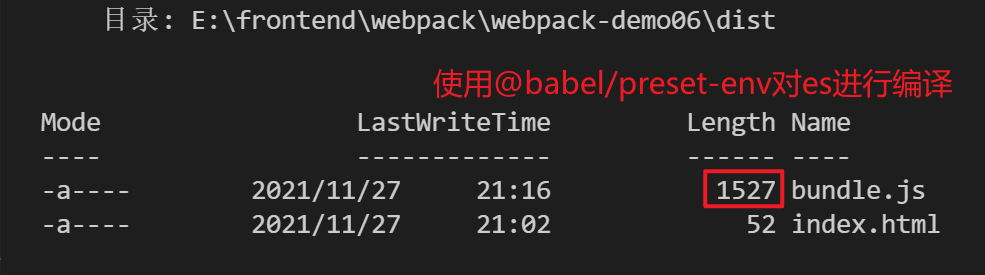
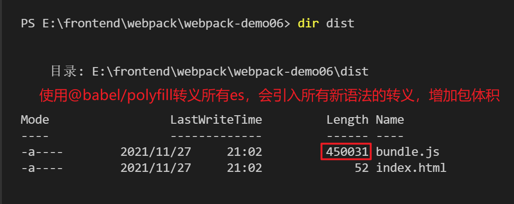
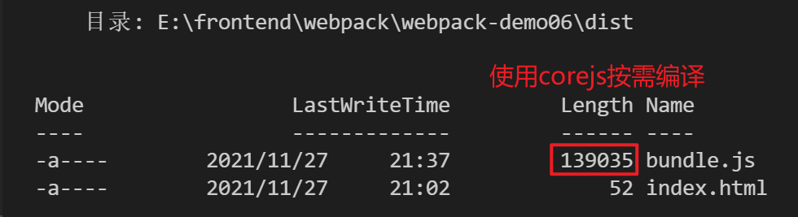

# Webpack 基础用法

1. [编译 HTML](#build-html)
2. [编译 CSS](#build-css)
3. [编译 JS](#build-js)
4. [编译图片](#build-image)
5. [编译字体](#build-font)
6. [资源模块 (Asset Modules)](#asset-module)
7. [开发服务器 (Dev Server)](#webpack-dev-server)

## <h2 id="build-html">编译 HTML</h2>

- [html-webpack-plugin](https://github.com/jantimon/html-webpack-plugin)

## <h2 id="build-css">编译 CSS</h2>

### 将 CSS 编译成独立的文件 [mini-css-extract-plugin](https://github.com/webpack-contrib/mini-css-extract-plugin#getting-started)

1. 安装 mini-css-extract-plugin

```
npm install mini-css-extract-plugin --save-dev
```

2. 在 webpack 配置文件(webpack.config.js)中引入插件并配置 CSS 模块加载器 loader

```js
const MiniCssExtractPlugin = require('mini-css-extract-plugin');
module.exports = {
    module: {
        rules: [
            test: /\.css$/i,
            use: [MiniCssExtractPlugin.loader, 'css-loader']
        ]
    },
    plugins: [
        new MiniCssExtractPlugin()
    ]
}
```

3. 由于 MiniCssExtractPlugin 插件只是将 CSS 代码编译成单独的 xxx.css 文件，并没有像 style-loader 那样在 header 标签内部生成 style 标签，所以需要借助 html-webpack-plugin 插件将独立的 css 文件通过 link 标签引入。

```js
const path = require('path');
const MiniCssExtractPlugin = require('mini-css-extract-plugin');
const HtmlWebpackPlugin = require('html-webpack-plugin');

module.exports = {
	entry: './src/index.js',
	output: {
		path: path.resolve(__dirname, './dist'),
		filename: 'main.js',
	},
	mode: 'development',
	module: {
		rules: [
			{
				test: /\.css$/i,
				use: [
					// 将 CSS 代码编译为单独的文件
					MiniCssExtractPlugin.loader,
					// 对 CSS 代码进行编译，将 css 代码加载到 js 代码中，作为模块管理
					'css-loader',
				],
			},
		],
	},
	plugins: [
		// MiniCssExtractPlugin 插件默认生成的 css 文件名称和编译前一样，如果需要单独指定编译后的 css 文件的目录和名称，可以使用该插件的 filename 属性
		new MiniCssExtractPlugin({
			filename: 'css/[name].css',
		}),
		new HtmlWebpackPlugin({
			// 指定生成的 html 页面的 title
			title: 'css-compile',
			// 指定 HtmlWebpackPlugin 的静态模板文件来生成 index.html
			template: './index.html',
		}),
	],
};
```

### 添加样式前缀 [postcss-loader](https://github.com/webpack-contrib/postcss-loader) + [autoprefixer](https://github.com/postcss/autoprefixer#webpack)

- 场景：对于新的 CSS 样式，对浏览器有兼容性问题，需要对属性加浏览器前缀
- 使用 webpack 插件对 css 样式添加前缀

1. 安装 postcss-loader autoprefixer

```
npm install postcss-loader autoprefixer --save-dev
```

2. 配置 webpack.config.js 文件

```js
{
  test: /\.css$/i,
  use: [MiniCssExreact.loader, 'css-loader', 'postcss-loader']
}
```

3. 新建 postcss.config.js 文件

```js
plugins: [require('autoprefixer')];
```

4. 配置需要兼容的浏览器

- 在 package.json 文件中指定 browserslist 字段配置

```json
"browserlist": [
    "last 1 version",   // 最后一个版本
    "> 1%"  // 代表全球超过 1% 使用的浏览器
]
```

- 创建 [browserslistrc](https://github.com/browserslist/browserslist) 文件

```.brweserslistrc
last 1 version
> 1%
```

更多配置项请查看[borwserslist-github](https://github.com/browserslist/browserslist#readme)

```
更多查询条件

> 5%:
> 5% in alt-AS:
> 5% in my stats:
cover 99.5%:
ios 7: ios 7自带的浏览器
Firefox ESR: 最新的火狐 ESR (长期支持版)版本的浏览器
ureleased version or unreleased Chrome version: alpha 和 beta 版本
last 2 major versions or last 2 ios major versions: 最近的两个发行版，包括所有的次版本号和补丁号变更的浏览器版本
since 2015 or last 2 years: 自某个时间以来更新的版本(也可以写的更具体 since 2015-03 或者 since 2015-03-10)
dead: 通过 last 2 versions 筛选的浏览器版本中，全球使用率低于 0.5% 并且官方声明不在维护或者事实上已经两年没有更新的版本。目前符合条件的有 IE10, IE_Mob 10, BlackBerry 10, BlackBerry 7, OperaMobile 12.1。
last 2 versions: 每个浏览器最近的两个版本。
last 2 Chrome versions:  Chrome 浏览器最近的两个版本。
defaults: 默认配置 > 0.5%, last 2 versions, Firefox ESR, not dead。
not ie <= 8: 浏览器范围取反。IE 浏览器版本 高于8。
可以添加 not 在任何查询条件前面表示取反。
```

编译前：

```css
.none-select {
	user-select: none;
}
```

编译后:

```css
.none-select {
	-webkit-user-select: none;
	-moz-user-select: none;
	-ms-user-select: none;
	user-select: none;
}
```

> 不允许同时在多处指定 浏览器列表(browserslist) 版本

### 校验格式 stylelint

#### 配置步骤

1. 安装依赖

```
npm install stylelint stylelint-config-standard stylelint-webpack-plugin --save-dev
```

2. 引入

```
const StylelintPlugin = require('stylelint-webpack-plugin');
```

3. 配置

```js
new StylintPlugin({
	// 指定规则应用的文件，目的是剔除编译后的 css 文件
	files: ['src/**/*.{css, less, sacc, scss}'],
});
```

4. 指定校验规则

- 在 package.json 中指定校验规则

```json
"stylelint": {
    "extends": "style-config-standard"
}
```

- 在 .stylelintrc.json 文件中设置

```json
{
	"extends": "stylelint-config-standard",
	"rules": {
		"indentation": 4,
		"number-leading-zero": "never",
		"unit-allowed-list": ["em", "rem", "s", "%"],
		"color-function-notation": "legacy"
	}
}
```

- 在 stylelint.config.js 中指定

> 注意：不允许同时在多处指定 stylelint 规则

#### 依赖说明

1. [stylelint](https://github.com/stylelint/stylelint/blob/HEAD/docs/user-guide/get-started.md)
   - [stylelint 文档](https://stylelint.docschina.org/)
   - [校验规则](https://stylelint.docschina.org/user-guide/rules/)
     - number-leading-zero: 要求或禁止小于 1 的小数有一个前导零
     - unit-case: 指定单位的大小写 "upper"|"lower"
     - color-function-notation: 颜色函数符号，颜色函数中多个值之间的分隔符号，/(斜杠，例如 **rgba(255 255 255 / 0.2)**)|,(逗号，例如 **rgba(255, 255, 255, 0.2)**) 对应的值分别为"modern"|"legacy"
     - unit-whitelist: 单位白名单，新版本 stylelint 中该规则被修改为 _unit-allowed-list_，对应的 unit-blacklist 改为了 _unit-disallowed-list_
     - [indentation](https://stylelint.docschina.org/user-guide/rules/indentation/): 缩进控制，默认两个空格，可选值 int|"tab"
     - [selector-list-comma-newline-after](https://stylelint.docschina.org/user-guide/rules/selector-list-comma-newline-after/): 在选择器列表的逗号之后需要换行符或不允许有空格。"always"|"always-multi-line"|"never-multi-line"，"在逗号之后必须有一个换行符"|"在多行选择器列表的逗号之后必须有一个换行符"|"在多行选择器列表的逗号之后不能有空白符"
     - [rule-empty-line-before](https://stylelint.docschina.org/user-guide/rules/rule-empty-line-before/): 要求或禁止在规则之前的空行
     - [no-missing-end-of-source-newline](https://stylelint.docschina.org/user-guide/rules/no-missing-end-of-source-newline/): 禁止缺少源码结尾换行符
2. [stylint-config-statdard](https://github.com/stylelint/stylelint-config-standard)
3. [stylint-webpack-plugin](https://webpack.docschina.org/plugins/stylelint-webpack-plugin/)

> 注意：在使用 StylelintWebpackPlugin 插件对 files 进行配置时，路径一定不能是以 **/** 开始的绝对路径，并且需要进行样式检测的 css 文件的路径一定要写对，不然将不会对 css 文件进行 lint 规则校验

> stylelint 是通过 files 字段对指定位置的 css 文件进行扫描，不一定是 js 中引入(import)的才做扫描校验

### CSS 压缩 [css-minimizer-webpack-plugin](https://github.com/webpack-contrib/css-minimizer-webpack-plugin)

#### 配置步骤

1. 安装依赖

```
npm install css-minimizer-webpack-plugin --save-dev
```

2. 在 webpack.config.js 中引入

```js
const MiniCssExtractPlugin = require('mini-css-extract-plugin');
const CssMinimizerPlugin = require('css-minimizer-webpack-plugin');

module.exports = {
	module: {
		rules: [
			{
				test: /.s?css$/,
				use: [MiniCssExtractPlugin.loader, 'css-loader', 'sass-loader'],
			},
		],
	},
	optimization: {
		// 注意，在development模式下，必须配置minimize为true，css-minimizer-webpack-plugin才会生效，才会对css进行压缩
		minimize: true,
		minimizer: [
			// For webpack@5 you can use the `...` syntax to extend existing minimizers (i.e. `terser-webpack-plugin`), uncomment the next line
			// `...`,
			new CssMinimizerPlugin(),
		],
	},
	plugins: [new MiniCssExtractPlugin()],
};
```

更多详细介绍可查看 [webpack](https://webpack.docschina.org/plugins/css-minimizer-webpack-plugin/#root) 官网对其介绍

## <h2 id="build-js">编译 JS</h2>

### ES 新特性编译

- 目的：ES6 转换为 ES5 兼容低版本浏览器

- 安装

```
npm install babel-loader @babel/core @babel/preset-env --save-dev
```

- 配置

  - https://www.npmjs.com/package/babel-loader

- 注意
  - 存在问题：@babel/preset-env 只能转义基本语法(不能完成 promise 转义)
  - 解决方案：使用 @babel/polyfill (转义所有 js 新语法)
    - npm install @babel/polyfill --save-dev
    - import '@babel/polyfill' (在入口文件中引入 @babel/polyfill)
  - 更优的解决方案
    - 使用 core-js 按需转义
    - 安装： npm install core-js --save-dev
    - 配置：
      - 按需加载 useBuiltIns: 'usage'
      - 指定版本 corejs:3





webpack 配置文件实例

```js
const path = require('path');
const HtmlWebpackPlugin = require('html-webpack-plugin');

module.exports = {
	mode: 'development',
	entry: './src/index.js',
	output: {
		path: path.resolve(__dirname, './dist'),
		filename: 'bundle.js',
	},
	optimization: {
		// minimize: true,
	},
	module: {
		rules: [
			{
				test: /\.m?js$/,
				exclude: /node_modules/,
				use: {
					loader: 'babel-loader',
					options: {
						presets: [
							[
								'@babel/preset-env',
								{
									// 按需加载
									useBuiltIns: 'usage',
									// core-js 版本
									corejs: 3,
									// 编译目标：node.js环境 还是 浏览器环境
									// targets: "defaults",
									// 允许手动指定对浏览器支持的兼容版本
									targets: {
										chrome: '58',
										ie: '9',
										firefox: '60',
										safari: '10',
										edge: '17',
									},
								},
							],
						],
					},
				},
			},
		],
	},
	plugins: [
		new HtmlWebpackPlugin({
			title: '学习使用 webpack 编译 es',
			template: './src/index.html',
		}),
	],
};
```

> 注意：options.presets 是**二维**数组

### js 格式校验

1. 安装依赖

```
npm install eslint eslint-config-airbnb-base eslint-webpack-plugin eslint-plugin-import --save-dev
```

- [eslint](https://eslint.org/)
- 常见 eslint 规则
  - semi: 语句结尾是否带分号，'always'
  - quotes: 引号是使用双引号还是单引号
  - linebreak-style: 换行符风格，默认是 linux 系统风格(/n)，需改为 windows 系统风格(/r/n)
- [eslint-config-airbnb-base](https://github.com/airbnb/javascript): 最流行的 js 代码规范
- [eslint-webpack-plugin](https://www.npmjs.com/package/eslint-webpack-plugin): eslint webpack 插件
- [eslint-plugin-import](https://www.npmjs.com/package/eslint-plugin-import): 用于加载 package.json 文件中的 eslintConfig 配置项 的插件

2. 修改配置文件

- eslint-webpack-plugin

  ```js
  const EslintPlugin = require("eslint-webpack-plugin");
  module.exports = {
    ...
    plugins: [new EslintPlugin(options)];
    ...
  }
  ```

- eslintConfig (package.json)

  ```json
  {
  	"eslintConfig": {
  		"extends": "airbnb-base"
  	}
  }
  ```

## <h2 id="build-image">编译图片</h2>

参考：[webpack5 的使用（四）：加载资源文件](https://juejin.cn/post/6970333716040122381)

### 编译 CSS 、 JS 中的图片资源

在 Webpack5 中可以使用内置的 [Asset Modules](https://webpack.docschina.org/guides/asset-modules/) 轻松地在 css 或 js 中引入图片资源。Asset Modules 是一种模块类型，它允许使用资源文件而无需配置额外的 loader。

修改配置文件:

```js
const path = require('path');

module.exports = {
	entry: './src/index.js',
	output: {
		filename: 'bundle.js',
		path: path.resolve(__dirname, 'dist'),
	},
	module: {
		rules: [
			{
				test: /\.css$/i,
				use: ['style-loader', 'css-loader'],
			},
+			{
+				test: /\.(png|jpe?g|gif)$/i,
+				type: 'asset',
+				generator: {
+					filename: 'img/[hash]',
+				},
+				parser: {
+					dataUrlCondition: {
+						maxSize: 8 * 1024,
+					},
+				},
+			},
		],
	},
};
```

在 Webpack5 之前，通常使用：

1. `row-loader`: 将文件导入为字符串
2. `url-loader`: 将文件作为 data URI 内联到 bundle 中
3. `file-loader`: 将文件发送到输出目录

Asset Module 通过添加 4 种新的模块类型，来替换所有这些 loader：

1. `asset/resource`: 发送一个单独的文件并导出 URL。之前是通过使用 `file-loader` 实现
2. `asset/inline`: 导出一个资源的 data URI。之前是通过 `url-loader` 实现
3. `asset/source`: 导出资源的源代码。之前是通过 `raw-loader` 实现
4. `asset`: 在导出一个 data URI 和发送一个单独的文件之间自动选择。之前是通过 `url-loader`，并且配置资源体积闲置来实现

当在 webpack 5 中使用旧的 assets loader（如 file-loader/url-loader/raw-loader 等）和 asset 模块时，你可能想停止当前 asset 模块的处理，并再次启动旧版 loader 处理，这可能会导致 asset 重复，你可以通过将 asset 模块的类型设置为 'javascript/auto' 来解决。

```js
module.exports = {
  module: {
   rules: [
      {
        test: /\.(png|jpg|gif)$/i,
        use: [
          {
            loader: 'url-loader',
            options: {
              limit: 8192,
            }
          },
        ],
+       type: 'javascript/auto'
      },
   ]
  },
}
```

### 编译 html 中的图片资源

[html-loader](https://www.npmjs.com/package/html-loader) 将 HTML 作为 string 导出，并且可以压缩 html。默认情况下，任何可被加载的属性都将被导入，例如 ``

1. 安装依赖

```
npm install html-loader --save-dev
```

2. 修改配置文件

```js
{
	test: /\.html$/i,
	loader: 'html-loader',
},
```

### Resource 资源

webpack.config.js

```js
const path = require('path');

module.exports = {
	entry: './src/index.js',
	output: {
		filename: 'main.js',
		path: path.resolve(__dirname, 'dist'),
	},
+	module: {
+		rules: [
+			{
+				test: /\.png/,
+				type: 'asset/resource',
+			},
+		],
+	},
};
```

src/index.js

```
import mainImage from './images/main.png';

img.src = mainImage; // '/dist/151cfcfa1bd74779aadb.png'
```

在使用 type 为 `asset/resource` 的 Asset Module 处理图片时，所有图片文件都将被发送到输出目录，并且其路径将被注入到 bundle 中。

### 自定义输出文件名

默认情况下，`asset/resource` 模块以 `[hash][ext][query]` 文件名发送到输出目录。

可以通过在 webpack 配置中设置 `output.assetModuleFilename` 来修改此模板字符串：

webpack.config.js

```js
const path = require('path');

module.exports = {
	entry: './src/index.js',
	output: {
		filename: 'main.js',
		path: path.resolve(__dirname, 'dist'),
+		assetModuleFilename: 'images/[hash][ext][query]',
	},
	module: {
		rules: [
			{
				test: /\.png/,
				type: 'asset/resource',
			},
		],
	},
};
```

另一种自定义输出文件名的方式是，将某些资源发送到指定目录：

```js
const path = require('path');

module.exports = {
  entry: './src/index.js',
  output: {
    filename: 'main.js',
    path: path.resolve(__dirname, 'dist'),
+   assetModuleFilename: 'images/[hash][ext][query]'
  },
  module: {
    rules: [
      {
        test: /\.png/,
        type: 'asset/resource'
      },
+     {
+       test: /\.html/,
+       type: 'asset/resource',
+       generator: {
+         filename: 'static/[hash][ext][query]'
+       }
+     }
    ]
  },
};
```

使用此配置，所有 `html` 文件都将被发送到输出目录中的 `static` 目录中。

> `Rule.generator.filename` 与 `output.assetModuleFilename` 相同，并且仅适用于 `asset` 和 `asset/resource` 模块类型

## <h2 id="build-font">编译字体文件</h2>

## <h2 id="asset-module">资源模块</h2>

## <h2 id="webpack-dev-server">webpack 开发服务器</h2>
